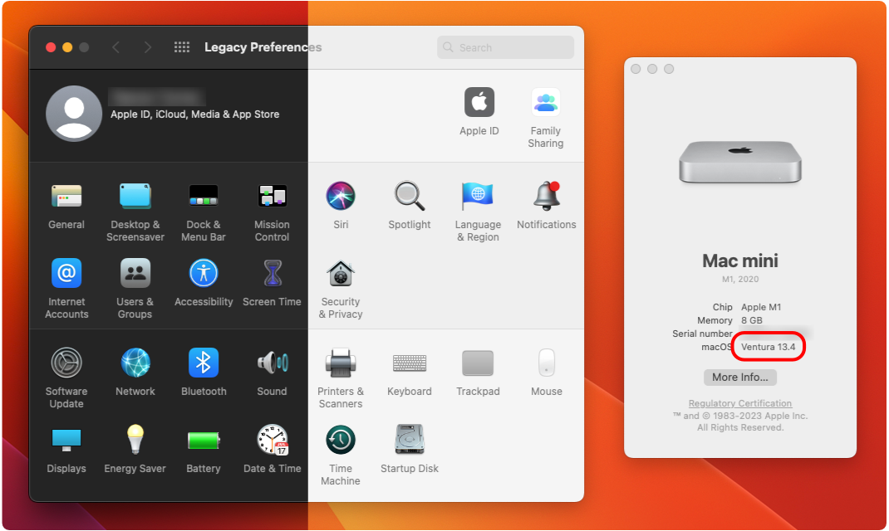

    <h1 align="left" style="">Legacy Preferences</h1>
    

    Work-In-Progress recreation of the classic System Preferences to make Ventura not suck.
         
    

 

    
    
    
    

___

## Project Deets
### Wat it do
There are many ways to attempt to restoration of the classic System Preferences in Ventura; but all those methods are pretty jank, require too much work, or just won't work. For example:
- Port an old app bundle on System Preferences from an older OS install
- Use the NSPreferencePane API to wrap the old `.prefPanes` (those also must be ported form an older OS) 

In order to truly return the ways of old, someone must take it upon themselves to recreate the old. This is a long work in progress, the end goal being replication of classic System Preferences; excluding panes that require interfacing with your Apple ID due to limitations. Check out the [completion checklist](#completion-checklist) if you care.

### Why it do
Because some of us miss the ways of old (see new [System Settings](https://9to5mac.com/2022/06/06/macos-13-ventura-system-settings-first-look/)).

## Installation
Until this is no longer a WIP, I'm not making any releases; but, you can build the project in Xcode if you want to use it in it's current state.

## Completion Checklist
### Features
- [ ] Spotlight Search
- [ ] Localization
- [X] ~~Basic Navigation~~
- [X] ~~Sort panes~~
- [X] ~~Hide panes~~
- [X] ~~Menu bar stuff~~
- [ ] Jump to pane from dock
- [ ] 3rd party panes
### Panes
| Status | Pane(s)
| ---- | ---- |
| ☑️ Almost Done, or Finished | General(Appearance) |
| 🛠️ WIP | All the rest (Dock & Menu Bar, Accessibillity, Displays, etc.) |
| ☠️ Dead until stated otherwise, just there for completion | Apple ID, Family Sharing, Screen Time, Time Machine, Startup Disk,  Software Update |
**Note:** Unsupported panes (excluding those there for completion) are disabled for now!

## Contribution
If anyone wishes to contribute towards pane stuff or finds some problems, feel free to open an issue or PR. I will respond and evaluate propositions as quick as possible.

## ⚠️ Disclaimer
The app icon used by Legacy Preferences was designed by Apple, not I, and belongs to the native System Preferences/Settings app.

Also, if I mess up implementing some preference and wigs out, I hold not responsibility for bricking your machine or nuking your filesystem.

No one sue me, thanks.

